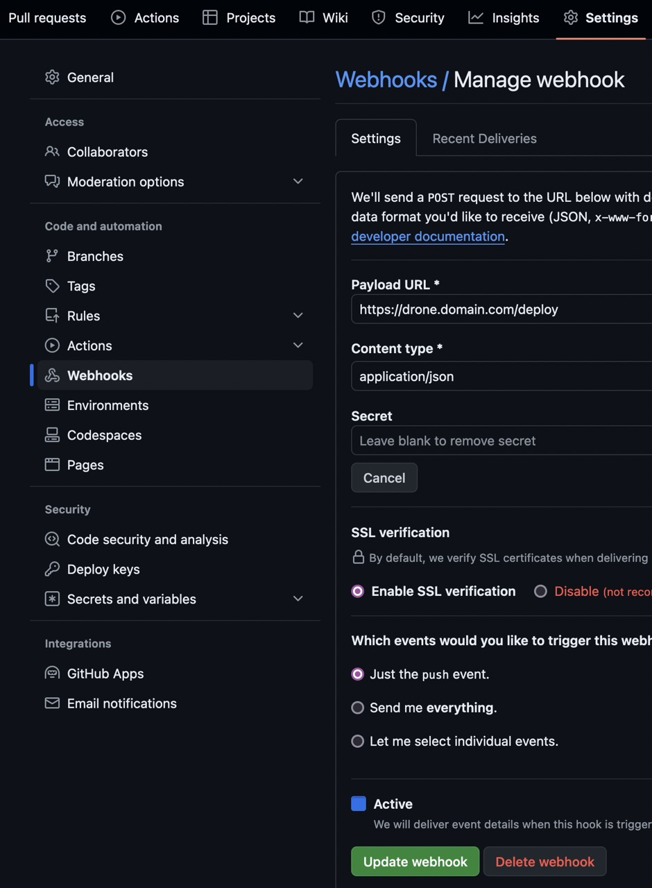
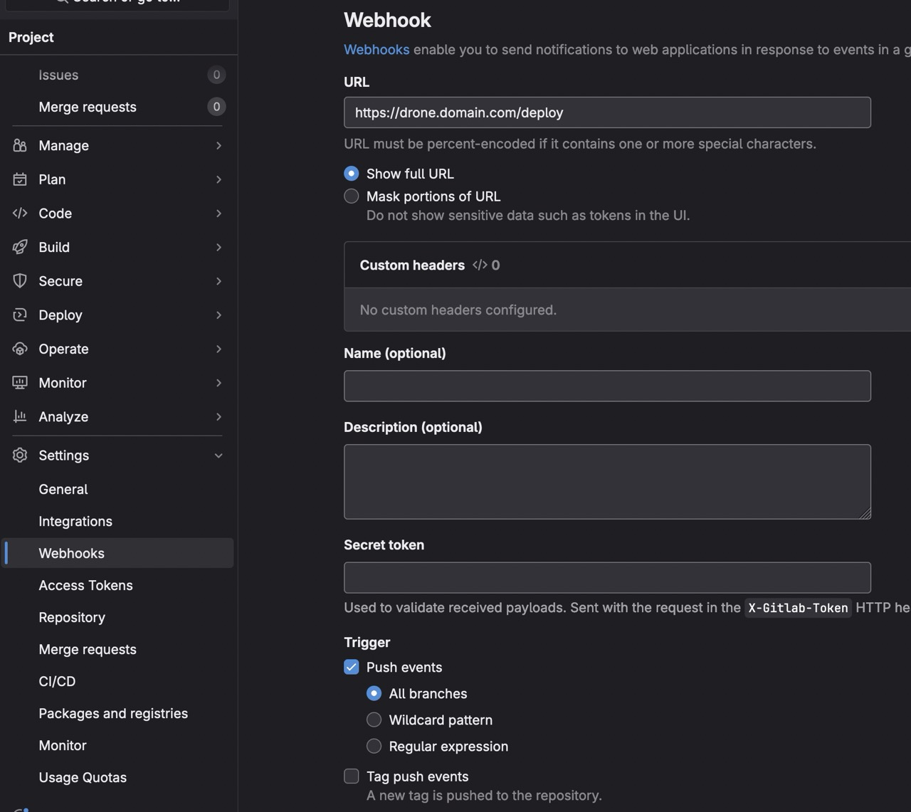
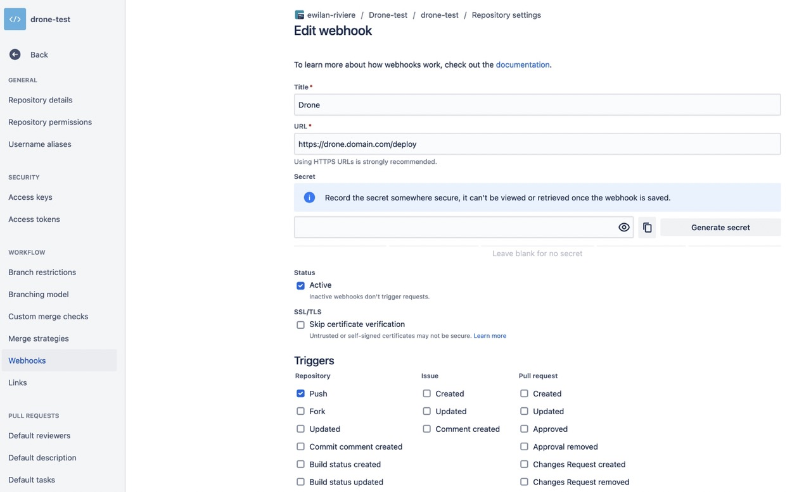

# Drone

[![version][version-src]][version-href]
[![h3][h3-version-src]][h3-version-href]
[![node][node-version-src]][node-version-href]
[![License][license-src]][license-href]

Auto-deployment tool for servers.

Currently support GitHub, GitLab, Bitbucket and Gitea.

## Installation

You have to install Drone on your server, Docker can't be used because Drone needs to access the host machine.

```bash
git clone https://github.com/ewilan-riviere/drone.git
cd drone
```

Create a `.env` file with the following content

```bash
cp .env.example .env
```

And fill in the environment variables:

- `ENV`: environment of the application (`development`, `production`, `test`)
- `PORT`: port of the application (into the container)
- `HOST`: host of the application
- `HTTPS`: enable HTTPS
- `ENDPOINT`: endpoint of deployment
- `SECRET_KEY`: secret key for the webhook
- `APP_PORT`: port of the application to deploy (into the server)

Best configuration for production:

```bash
ENV=production
PORT=3000
HOST=domain.com
HTTPS=true
ENDPOINT=/deploy
SECRET_KEY=
APP_PORT=3000
```

- If you change `ENDPOINT`, you have to adapt the webhook configuration of your repository.
- Change `APP_PORT` if you want to point to another port.
- You can let `SECRET_KEY` empty if you don't want to use a secret key (for GitLab it's `Secret token`, for GitHub it's `Secret`, for Bitbucket it's `Secret`, for Gitea it's `Secret`). If you set a secret key, you need to set it in the webhook configuration of your repository, otherwise the deployment will not work.

### Build

Here I use [`pnpm`](https://pnpm.io/) as package manager, you can install `pnpm` or use [`npm`](https://www.npmjs.com/) if you prefer.

```bash
pnpm install
```

Build the application

```bash
pnpm build
```

### Serve the application

To keep alive the application, you can use [`pm2`](https://pm2.keymetrics.io/).

```bash
pm2 start ./dist/index.js
```

### Deploy

You can use a reverse proxy to serve the application.

Example for Nginx: [nginx.conf](./docs/nginx.conf)

If you don't use `3000` as port, you have to change it in the configuration file.

```nginx
server {
  # ...

  location / {
    proxy_pass http://127.0.0.1:3000; # Change the port if needed
  }
}
```

## Configuration

You can add your repositories into `config/repositories.json` file.

```bash
vim config/repositories.json
```
The key is the owner and the repository name separated by a slash. The value is the path to the local repository.

```json
{
  "owner/git-repository-name": [
    "/path/to/local/repository",
    "/path/to/local/repository-develop"
  ],
  "another-owner/another-git-repository-name": "/path/to/another/local/repository",
  "alternative-owner/alternative-git-repository-name": "/path/to/alternative/local/repository"
}
```

Example for the repository <https://github.com/ewilan-riviere/drone>

```json
{
  "ewilan-riviere/drone": "/path/to/drone"
}
```

You can set a value as an array to deploy multiple instances of the same repository.

```json
{
  "ewilan-riviere/drone": [
    "/path/to/drone",
    "/path/to/drone-develop"
  ]
}
```

## Usage

When you push to your repository, the webhook will trigger the deployment. This option is available for GitHub, GitLab, Bitbucket and Gitea.

## Configure webhooks on forges

### GitHub

You can set a webhook on GitHub by going to the repository settings, then `Webhooks`, then `Add webhook`.

- Payload URL: `https://drone.domain.com/deploy`
- Content type: `application/json`
- Secret: your secret key (if you set one)
- Events: `Just the push event`



### GitLab

You can set a webhook on GitLab by going to the repository settings, then `Webhooks`, then `Add webhook`.

- URL: `https://drone.domain.com/deploy`
- Secret token: your secret key (if you set one)
- Trigger: `Push events` (you can specify branches)



### Bitbucket

You can set a webhook on Bitbucket by going to the repository settings, then `Webhooks`, then `Add webhook`.

- Title: `Drone`
- URL: `https://drone.domain.com/deploy`
- Secret: your secret key (if you set one)
- Triggers: `Repository push`



## Credits

- [`adr1enbe4udou1n/drone`](https://github.com/adr1enbe4udou1n/drone): original project

## License

[MIT](LICENSE)

[version-src]: https://img.shields.io/badge/dynamic/json?label=version&query=version&url=https://raw.githubusercontent.com/ewilan-riviere/drone/main/package.json&colorA=18181B&colorB=F0DB4F
[version-href]: https://github.com/ewilan-riviere/drone/-/tags
[h3-version-src]: https://img.shields.io/badge/dynamic/json?label=h3&query=dependencies['h3']&url=https://raw.githubusercontent.com/ewilan-riviere/drone/main/package.json&colorA=18181B&colorB=F0DB4F
[h3-version-href]: https://github.com/unjs/h3
[license-src]: https://img.shields.io/github/license/ewilan-riviere/drone.svg?style=flat-square&colorA=18181B&colorB=777BB4
[license-href]: https://github.com/ewilan-riviere/drone/blob/main/README.md
[node-version-src]: https://img.shields.io/badge/dynamic/json?label=Node.js&query=engines[%27node%27]&url=https://raw.githubusercontent.com/ewilan-riviere/drone/main/package.json&style=flat-square&colorA=18181B&colorB=F0DB4F
[node-version-href]: https://nodejs.org/en/

